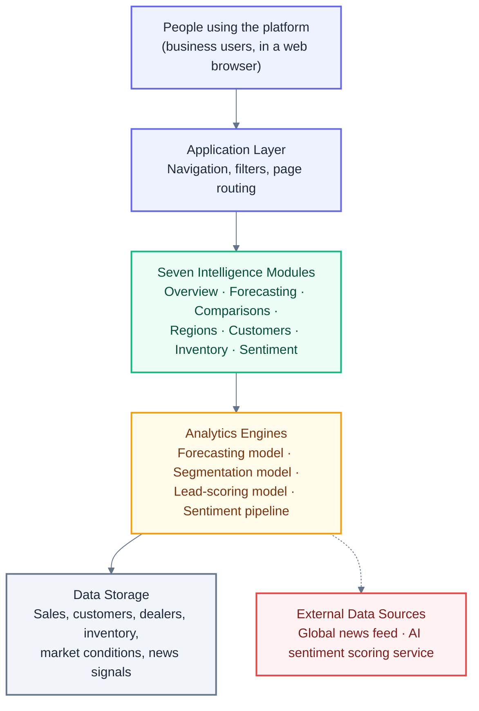
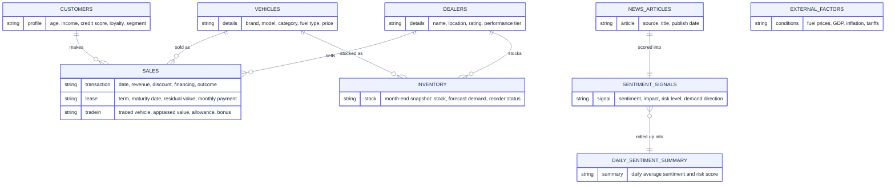
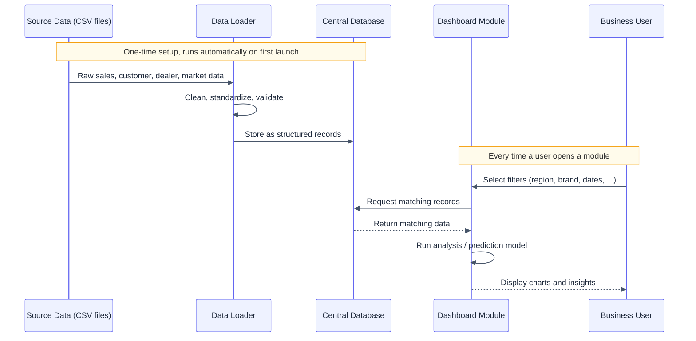
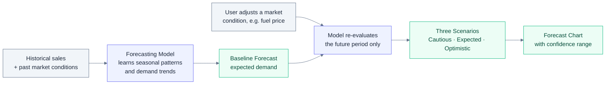
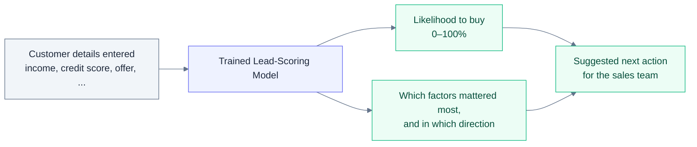
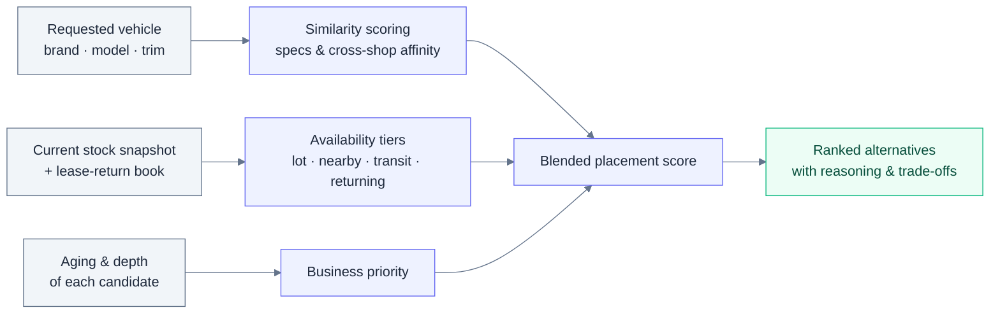
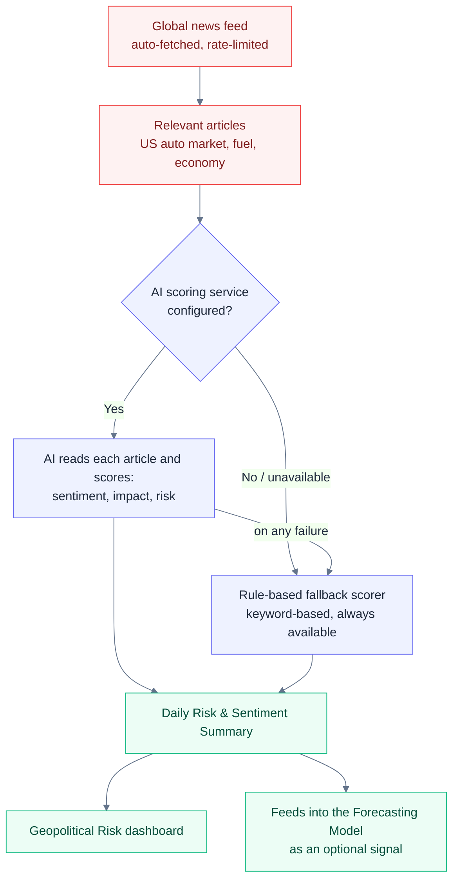

# PredictaX Demand Prediction — Architecture Overview

**Product name (on screen):** Automobile Demand Intelligence Platform

This document explains how the platform is built and how information moves through it — for engineers, technical leads, or reviewers who want to understand the system's design without reading through source code line by line. It favors diagrams and plain technical explanation over code excerpts. For exact implementation detail (file names, function signatures, exact model parameters), see `TECHNICAL_DOCUMENTATION.md` in the same repository.

---

## 1. What the Platform Does

The platform is a single web dashboard that helps North American (US, 8-state) automobile businesses forecast demand, understand customers, plan inventory, and track how world events affect the car market. It combines a transaction database, three predictive models, and a live news-analysis pipeline into one interface, organized into seven modules a user navigates between.

---

## 2. Technology Choices

| Layer | Technology | Why it fits |
|---|---|---|
| Application & UI | Streamlit (Python) | Lets a data/ML team ship a full interactive dashboard without a separate frontend codebase |
| Charts | Plotly | Interactive charts and the dealer map, rendered directly from Python |
| Data storage | SQLite, accessed through SQLAlchemy | Lightweight, file-based, zero setup — appropriate for a POC/demo scale |
| Demand forecasting | Prophet (time-series forecasting library) | Handles seasonality and external factors well with modest data volume |
| Customer segmentation | K-Means clustering | Simple, explainable grouping of customers into behavioral segments |
| Lead scoring | XGBoost + SHAP | Strong tabular-data performance, with SHAP providing a "why" behind each prediction |
| News & sentiment | GDELT news feed + an AI language model, with a rule-based fallback | Combines real-world events with a consistent no-cost fallback when the AI service isn't configured |
| Packaging | Docker | Reproducible environment for local dev and deployment |

---

## 3. System Architecture

The platform is organized in layers: a UI layer the user interacts with, an application layer that manages navigation and filters, the seven intelligence modules themselves, the analytics engines that do the actual prediction work, and the data layer underneath everything.

A single set of filters (date range, state, city, brand, vehicle type, fuel type) sits above all seven modules and narrows down what each one shows. Choosing a module on the left simply swaps which module renders in the main panel — the filters and underlying data connection stay the same underneath.

One important operating characteristic: nothing is cached. Each time a user changes a filter or a setting, the relevant module re-queries the database and — on the Forecasting page — retrains its prediction model from scratch. This keeps every view fully up to date at the cost of some responsiveness; it's a reasonable tradeoff at the current data volume and worth revisiting if usage grows.

---

## 4. Data Model

All business data lives in a relational database with nine tables. Customers, vehicles, and dealers are the core reference entities; sales and inventory records connect them together; and a separate set of tables tracks daily market conditions and news-derived sentiment.

Two independent copies of this database exist side by side, both fully synthetic: one holding a **richer, primary NA market dataset** (referred to internally as "real" mode, in the sense of being the main dataset the app is built around, not because it's sourced from actual real-world sales records) and one holding a lighter **synthetic test dataset**. The application currently always runs against the primary dataset, though the underlying design supports switching between the two.

A practical detail worth documenting: on hosting environments where the application's own folder can't be written to, the platform automatically detects this and works from a temporary writable copy of the database instead, so the app doesn't crash — any changes made in that situation simply don't persist past that session, and the committed database is never at risk of corruption.

---

## 5. End-to-End Data Flow

The news and sentiment pipeline runs on a separate track from this — it doesn't happen automatically on page load. It only runs when a user explicitly refreshes it, or a lightweight version of it runs quietly in the background the first time someone opens the Sentiment module in a session, described in Section 8.

---

## 6. Demand Forecasting

The forecasting module predicts future sales volume or revenue using a time-series model trained on historical transactions plus market condition data (fuel prices, inflation, tourism activity, and similar factors). It automatically learns weekly and yearly seasonal patterns from the sales history, so it captures effects like holiday spikes or slow months on its own.

| Setting | Value |
|---|---|
| Forecast horizon | 30 to 365 days, user-selectable |
| Confidence range | 70%–99%, user-selectable |
| Seasonal patterns learned | Weekly and yearly |
| Market factors considered | Up to 18, including fuel prices, GDP growth, inflation, import tariffs, tourism, and EV infrastructure — each only used if it actually varies in the data |
| Model validation | Last 30 days of history held back and compared against the model's own prediction, to report accuracy honestly |

### What-if scenario testing

The most interactive part of this module lets a user drag sliders for market conditions — for example, raising the assumed gasoline price — and immediately see how the forecast shifts. Two things happen together when a slider moves:

1. The model itself is re-evaluated with the new assumption applied to the future period only (history is never altered).
2. A secondary, hand-tuned sensitivity reference (built from domain assumptions about how strongly each factor typically affects car demand) further scales the future prediction, so the visual effect of moving a slider is clear and proportionate.

The three scenario lines shown on the chart (Cautious, Expected, Optimistic) come from the model's own statistical confidence range at the confidence level the user selected — they widen or narrow directly with that slider.

The same forecasting model, optionally combined with sentiment data from Section 8, powers the "Forecast Comparison" view — running two versions side by side (with and without news sentiment as an input) so the team can see whether factoring in current events actually improves prediction accuracy.

---

## 7. Customer, Lead & Placement Intelligence

Three models sit in this layer: two in the Customer module, and the placement recommender that powers Inventory Intelligence.

### Customer segmentation

Every customer is grouped into one of five behavioral segments — such as Premium Buyer, Budget Buyer, or High Repeat Customer — based on income, credit score, past purchase count, loyalty, and churn risk. The grouping is done automatically by a clustering algorithm, and the resulting segment labels are then written back onto each customer's record so the rest of the platform can use them.

### Lead conversion scoring

The interactive lead-scoring tool takes a hypothetical customer's details (income, credit score, offer terms, lead source, and so on) and returns a likelihood that they will actually convert into a sale. Alongside the score, it shows which specific factors pushed the likelihood up or down — this explanation is produced by inspecting the trained model's actual decision process (not a separate guess), so it reflects what the model really weighed.

**Financing method is deliberately excluded from this model.** How a deal is paid for is an outcome of the negotiation rather than a driver of whether the customer buys — it is agreed late in the process, so including it let the model partly predict the close from the close. Left in, it attracted a large explanatory weight and generated advice to "switch the customer to a bank loan", which was an artifact of that leakage rather than a lever anyone can actually pull. Financing is still captured on every deal record, where it does real work: it drives the lease-return pipeline described below.

### Alternative vehicle placement

When the exact vehicle a customer asked for is unavailable, this recommends what the network can actually deliver instead. A usable recommendation has to satisfy three constraints at once, and scoring only the first is what makes most "similar vehicles" widgets useless on a showroom floor:

1. **Similarity** — is it the same car to this shopper? Scored on body style, price, powertrain, seating, power, drivetrain and brand, using cross-shopping affinity weights (a minivan shopper will consider a three-row SUV but never a coupe).
2. **Availability** — how soon can they take delivery? Four tiers, best first: on this lot, at a nearby store within the search radius, inbound in transit, or returning off lease within 45 days.
3. **Business value** — does placing it help the store? Weighted toward aged units, since a car at 90+ days is burning floorplan every day it stays.

The fourth availability tier only exists because the lease book is modelled — it is supply the network already owns. Each recommendation carries its reasoning: what matches, what the customer gives up, and where the car physically is.

The segmentation and lead-scoring models are trained ahead of time on historical data rather than learning live from each interaction — using them in the dashboard is fast because it's just applying an already-trained model. The placement recommender is computed on demand instead, because it has to reflect the stock position as it stands right now.

---

## 8. Sentiment & Geopolitical Risk Pipeline

This module connects real-world news to expected car demand. It pulls recent articles relevant to the US auto market, fuel prices, tariffs/trade policy, and the broader economy from a global news index, then scores each one for sentiment (positive/negative), potential impact, and economic risk level.

The system automatically uses the AI scoring service when it's configured, and falls back to a consistent rule-based scorer when it isn't (or if the AI service has a temporary issue) — either way, the dashboard always has something meaningful to show, and the two paths produce results in exactly the same format so nothing downstream needs to know which one ran.

The daily risk score itself reflects both **how negative** the day's news was and **how much of it** was negative — a single very negative headline moves the needle less than a day where most articles lean negative. To avoid unnecessary AI usage, a lightweight version of this scoring runs automatically and quietly using only the fallback method whenever someone opens the Sentiment module; the full AI-powered analysis only runs when a user explicitly clicks "Refresh Data."

---

## 9. Module Reference

| Module | What it's built on |
|---|---|
| Executive Overview | Aggregated sales/revenue queries |
| Demand Forecasting | Forecasting model (Section 6) |
| Comparative Analytics | Year-over-year queries, plus a dedicated Import Tariff Exposure analysis comparing domestic and import auto brands under the 2025 Section 232 tariffs |
| Store Performance | Per-rooftop scorecard — units, pace vs each store's own target, YoY, close rate — on a footprint map and a sortable table |
| Customer Intelligence | Segmentation + lead-scoring models (Section 7) |
| Inventory Intelligence | Four sub-modules built on inventory *flow*: **Stock Health** (current position, aging ladder, reorder priorities), **Inventory Flow & Lease Returns** (forward lease-return book, net order gap, remarketing lanes, re-capture pipeline), **Trade-In & Acquisition** (used-supply intake, true-concession waterfall, incentive elasticity), and the **Placement Assistant** (Section 7) |
| Sentiment Analysis | News and sentiment pipeline (Section 8) |

Three additional modules — a broader scenario simulator, a CSV data-upload tool, and a model-performance viewer — are already built but not currently switched on in the navigation menu. They're straightforward to enable if the roadmap calls for them.

---

## 10. Configuration

The platform is configured through environment variables rather than files committed to the repository — this keeps credentials and environment-specific settings out of version control.

| Setting | Controls |
|---|---|
| Database location overrides | Where each of the two databases (real / test) is read from |
| AI service credentials | Presence of this setting is what switches sentiment scoring from the rule-based fallback to live AI scoring |
| AI model selection | Optional override of which AI model version is used |
| Debug flag | Verbose logging toggle |

No credentials or secrets are stored in the application's own configuration files — everything sensitive is expected to be supplied by the hosting environment.

---

## 11. Deployment

The application is packaged as a Docker container: a single image bundles the application code, a pre-seeded test database, and pre-trained test-mode models, so the container is ready to run immediately after starting. A companion Docker Compose file runs it locally with the appropriate ports and storage locations mapped, so a new team member can be running the full stack within minutes.

---

## 12. Engineering Notes for the Team

Practical things worth knowing before extending this platform:

- **No caching layer exists yet.** Every interaction re-queries the database, and the forecasting page retrains its model on every change. This is the highest-value performance improvement available if the platform needs to support more concurrent users or larger datasets.
- **Only the test-data models are retrained automatically.** The real-data models were produced separately; there's currently no one-command way to retrain them after a real-data update.
- **The lead-scoring explanation has a silent fallback.** If the explainability library isn't available for any reason, the tool falls back to a simplified explanation that looks the same in the UI — worth keeping in mind if that explanation is ever relied on for a high-stakes decision.
- **The forecast's what-if sliders combine two effects** (the model's own re-evaluation, plus a hand-tuned sensitivity reference) — useful to know if anyone asks whether the scenario predictions are "pure machine learning."
- Three finished but disabled modules (scenario simulator, CSV upload, model metrics viewer) represent ready-to-go future functionality, not unfinished work.
