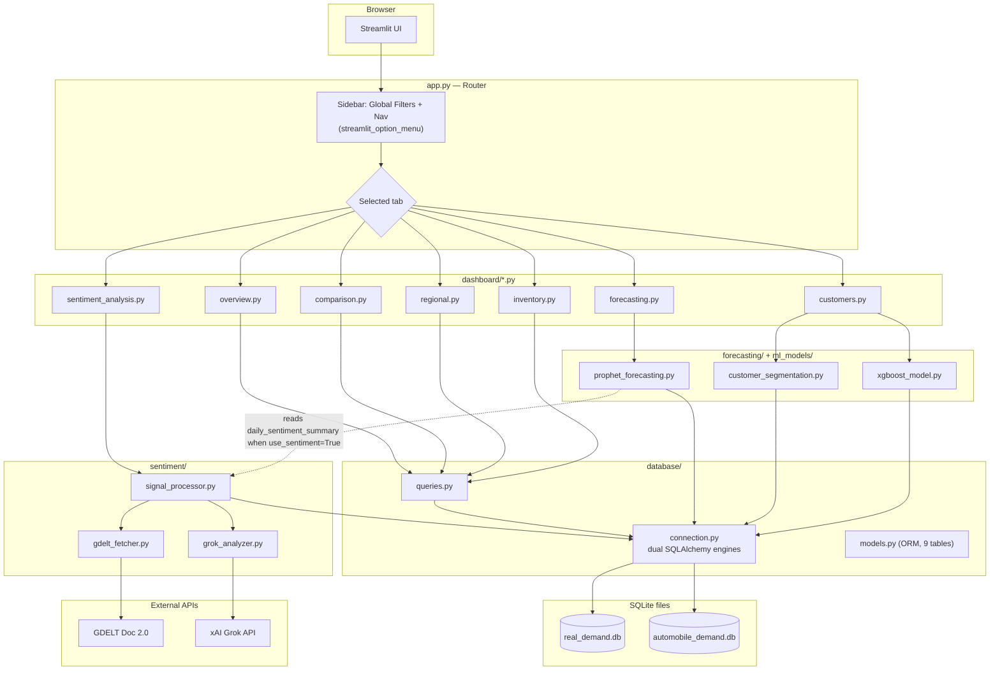
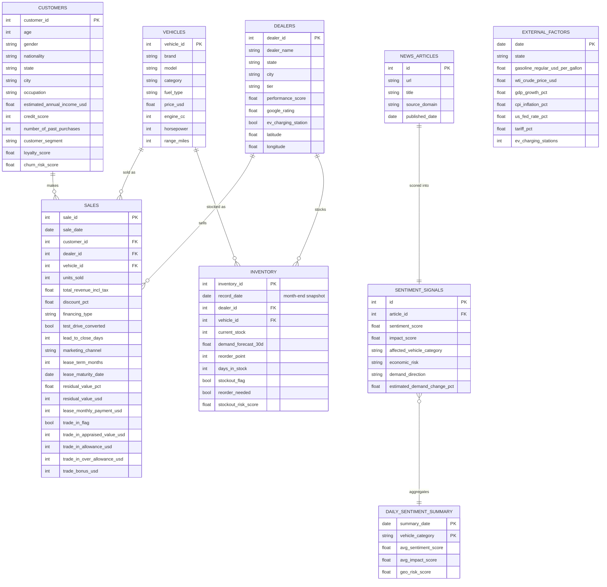
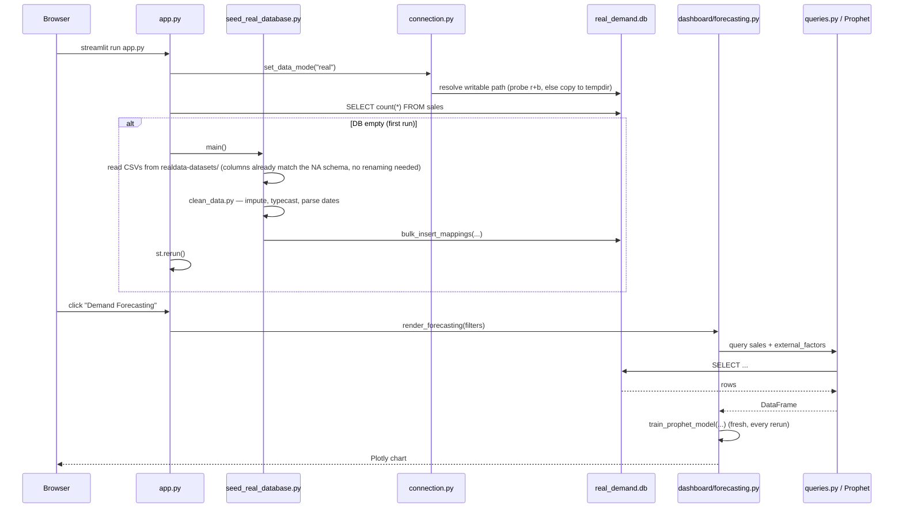
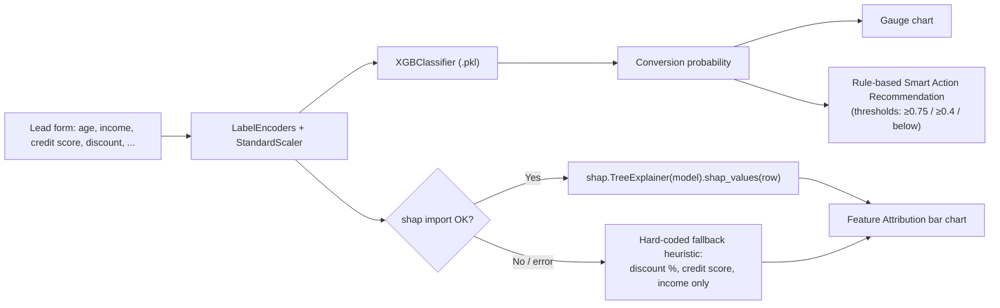
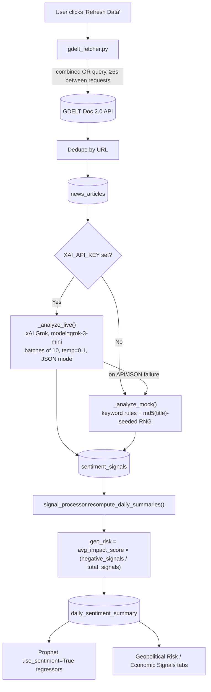

# PredictaX Demand Prediction — Technical Documentation

**Product name (on screen):** Automobile Demand Intelligence Platform
**Purpose:** Streamlit dashboard for North American (US, 8-state) automobile demand forecasting, customer/lead intelligence, inventory planning, and geopolitical/news sentiment analysis.

This document is for engineers joining the project. It covers architecture, data flow, database schema, the ML/forecasting internals, the sentiment pipeline, configuration, and deployment. Diagrams are Mermaid — they render natively on GitHub and in VS Code (with the Mermaid preview extension).

---

## 1. Tech Stack

| Layer | Technology |
|---|---|
| UI / app framework | Streamlit `>=1.35.0`, `streamlit-option-menu` for the sidebar nav |
| Charts | Plotly `>=5.22.0` (all charts, incl. the Mapbox dealer map) |
| Data layer | SQLAlchemy `>=2.0.0` ORM over **SQLite** (two separate `.db` files) |
| Forecasting | Facebook/Meta **Prophet** `>=1.1.5` |
| Customer segmentation | scikit-learn **KMeans** `>=1.4.0` |
| Lead scoring | **XGBoost** `>=2.0.0` (`XGBClassifier`) + **SHAP** `>=0.45.0` for explainability |
| News ingestion | **GDELT Doc 2.0 API** (public, no key) |
| Sentiment scoring | **xAI Grok** (`grok-3-mini`, via OpenAI-compatible SDK) with a deterministic keyword-based mock fallback |
| Config | `python-dotenv` (`.env`), no `st.secrets` used anywhere |
| Packaging / deploy | Docker (`Dockerfile`, `docker-compose.yml`) |

No JavaScript/frontend framework exists — Streamlit generates the entire UI server-side from Python.

---

## 2. Repository Layout

```
app.py                     Entry point / router / global filters
train_models.py            CLI: seeds test DB + trains all ML artifacts

dashboard/                 One render_*(filters) function per page
  overview.py               Executive Overview        [active]
  forecasting.py            Demand Forecasting         [active]
  comparison.py             Comparative Analytics      [active]
  regional.py                Regional Intelligence      [active]
  customers.py               Customer Intelligence      [active]
  inventory.py                Inventory Intelligence     [active]
  sentiment_analysis.py       Sentiment / Geo Risk        [active]
  ai_insights.py              Scenario Simulator          [written, NOT routed]
  upload_data.py              CSV upload + retrain UI      [written, NOT routed]
  metrics.py                  Model metrics viewer         [written, NOT routed]

database/
  connection.py             Dual SQLAlchemy engines, mode switch, writable-path fallback
  models.py                 ORM models — 9 tables
  queries.py                Every read query used by the dashboards

forecasting/
  prophet_forecasting.py    Prophet train/predict pipeline, market-driver overrides

ml_models/
  customer_segmentation.py  KMeans clustering (writes segments back to DB)
  xgboost_model.py          Lead-conversion classifier + SHAP explainability
  vehicle_placement.py      Alternative-vehicle recommender (no training step)

sentiment/
  fetchers/gdelt_fetcher.py     GDELT news client (rate-limited)
  analyzers/grok_analyzer.py    LIVE (Grok) / MOCK sentiment scorer
  signal_processor.py           Aggregation, formulas, orchestration

preprocessing/
  seed_database.py          CSV → SQLite loader (test mode)
  seed_real_database.py     CSV → SQLite loader (real mode)
  clean_data.py              Shared per-table cleaning/typing functions
  fix_*.py, patch_*.py, ...  One-off data-repair scripts (hand-tuning real dataset)

utils/helpers.py            CSS injection, KPI card renderer, palette
models/                     Persisted pickles, mode-scoped: {clustering,xgboost}/{test,real}/
automobile_datasets/        Synthetic "test" mode source CSVs
realdata-datasets/          Synthetic NA (US, 8-state) "real" mode source CSVs — generated by preprocessing/generate_na_data.py
assets/                     Logo, custom.css
.streamlit/config.toml      Dark theme config (no secrets.toml committed)
Dockerfile, docker-compose.yml
```

Two SQLite files live at repo root and are used interchangeably depending on data mode: `automobile_demand.db` (test) and `real_demand.db` (real).

---

## 3. High-Level Architecture



**Key architectural fact:** there is **no caching layer anywhere** in the app (`@st.cache_data` / `@st.cache_resource` are not used). Every widget interaction triggers a full Streamlit script rerun, which re-runs all DB queries and — on the Forecasting page — **retrains Prophet from scratch twice** (once for validation metrics, once on the full dataset). This is fine for a demo/POC at current data volume but is the first thing to address before scaling usage.

---

## 4. Application Bootstrap & Routing (`app.py`)

1. `st.set_page_config(page_title="Automobile Demand Intelligence Platform", layout="wide", initial_sidebar_state="expanded")`.
2. `inject_custom_css()` (`utils/helpers.py`) loads `assets/styles/custom.css`.
3. **Data mode bootstrap**: `st.session_state.data_mode` defaults to `"real"`. The Test/Real switch UI exists in code but is fully commented out — the app is effectively hard-locked to Real mode unless someone edits `app.py` or calls `set_data_mode("test")` directly.
4. On first load in Real mode, if the `sales` table is empty, `preprocessing/seed_real_database.py::main()` runs inside a spinner, then `st.rerun()`.
5. Sidebar nav is `streamlit_option_menu.option_menu` with 7 live entries; 3 more (`Insights & Simulator`, `Data Ingestion Engine`, `Model Performance Metrics`) exist but their imports/menu entries are commented out.
6. **Global filters** (date range, State, City, Brand, Vehicle Category, Fuel Type) are collected once into a `filters: dict` and passed positionally into every `render_*(filters)` call. City options dynamically re-query based on the selected State.
7. Routing is a plain `if/elif` chain on the selected menu string → `dashboard.<module>.render_*(filters)`.

### Session state keys in use
`data_mode`, `market_overrides`, `sentiment_pipeline_running`, `sentiment_pipeline_status`, `sentiment_briefing`, `sentiment_briefing_stats`, `fc_cmp_base`, `fc_cmp_sent`, `fc_cmp_target`, `fc_cmp_horizon`.

---

## 5. Database Layer

### 5.1 Dual-engine design

`database/connection.py` maintains **two independent SQLAlchemy engines/sessions in the same process**:

| Mode | File | Env override |
|---|---|---|
| `real` (default, only reachable mode via UI) | `real_demand.db` | `REAL_DATABASE_URL` |
| `test` | `automobile_demand.db` | `DATABASE_URL` |

`set_data_mode(mode)` / `get_data_mode()` flip a module-level global; `get_db_session()` returns a session from whichever engine is active. This single switch also controls which model-pickle subfolder (`models/{clustering,xgboost}/{test,real}/`) each ML module loads from, and several dashboard branches (Overview, Customers, Regional) that show different KPI columns per mode.

### 5.2 Writable-path fallback

Relevant to the earlier commits fixing DB writability on read-only hosts (e.g. Streamlit Community Cloud):

```python
# database/connection.py — _resolve_writable_sqlite_path (paraphrased)
try:
    open(target_path, "r+b")           # actually probe the real DB file
except OSError:
    shutil.copy(target_path, tempfile.gettempdir())
    target_path = tempdir_copy_path    # writes land in temp, not the repo
```

The earlier bug was probing a *sibling* file's writability, which can succeed even when the committed DB file itself is locked/read-only. The fix opens the **actual target file**. If unwritable, it copies the committed DB into the OS temp directory and points the engine there — writes survive for the life of that process only; a redeploy always resets to the checked-in baseline. Both DBs go through this resolver independently.

### 5.3 Schema (ER diagram)



> Note: `Sale` denormalizes `brand`/`vehicle_category`/`fuel_type`/`state`/`city` directly onto each row (in addition to the FK relationships) purely for query-speed convenience in the dashboards.

### 5.4 Query layer (`database/queries.py`)

- Every function takes a SQLAlchemy `Session` and returns a `dict` (KPI functions) or a `pd.DataFrame` (via `pd.read_sql`).
- `_apply_sale_filters` is a shared helper applying region/city/category/fuel/brand/financing/date filters — used by nearly every `Sale`-based query.
- **National scaling**: the dataset is a documented representative sample of the modeled 8-state NA market. `NATIONAL_SCALE_FACTOR = 17` is applied to sales/revenue KPIs so displayed numbers represent estimated national totals, not raw row counts.
- The "Import Tariff Exposure" queries (`get_brand_origin_yearly_share`, `get_price_competitiveness`, `get_ev_segment_by_brand_year`, `get_market_share_shift`) intentionally **ignore the sidebar brand filter** so the competitive-analysis section always shows the full market. The 2027 share projection uses `np.polyfit` (simple linear regression) on year-over-year share.

---

## 6. Data Flow (Seed → Query → Render)



The sentiment pipeline is a separate, user-triggered flow (see §8) — it doesn't run on page load, only on the "Refresh Data" button or lazily via `ensure_recent_articles_analyzed()` (mock-only, on tab open).

---

## 7. Forecasting Engine (`forecasting/prophet_forecasting.py`)

Single entry point: `train_prophet_model(category, region, fuel_type, target, horizon_days=90, interval_width=0.95, use_sentiment=False, market_overrides=None)` — called fresh on every UI interaction, no caching.

**Pipeline:**
1. Pull daily `Sale.units_sold` or `Sale.total_revenue_incl_tax`, filtered by category/region/fuel_type, reindexed to fill missing dates with 0.
2. Pull `ExternalFactor` columns (monthly), resample to daily via `.resample('D').ffill()`, merge onto sales by date.
3. If `use_sentiment=True`, merge `avg_sentiment_score` and `geopolitical_risk_score` from `signal_processor.get_daily_summaries()` (wrapped in try/except — a missing sentiment table fails silently, forecast just proceeds without those regressors).
4. **Model config**: `Prophet(yearly_seasonality=True, weekly_seasonality=True, daily_seasonality=False, interval_width=interval_width)`. Growth type and changepoint settings are left at Prophet defaults — not tuned anywhere.
5. **Regressors**: iterates a fixed candidate list of ~18 external-factor/sentiment columns; each is added via `model.add_regressor(reg)` only if present **and** has more than one distinct value (constant columns auto-excluded).
6. **Validation split**: last 30 rows held out; reports RMSE, MAE, and a custom `accuracy = max(0, min(1, 1 - mae/mean_y)) * 100`.
7. **Retrains on the full dataset** for the actual forecast — i.e. every call trains Prophet twice.
8. `future = full_model.make_future_dataframe(periods=horizon_days)`; historical regressor values are back-filled, then **user market-driver overrides are applied only to future-dated rows**.
9. `forecast = full_model.predict(future)`; negative `yhat`/bounds are clipped to 0.

### 7.1 What-if slider → forecast chart, full path

```mermaid
flowchart LR
    Slider["User moves e.g. Gasoline Price slider"] --> Form["st.form('market_drivers_form')"]
    Form --> Session["st.session_state.market_overrides"]
    Session --> Train["train_prophet_model(market_overrides=...)"]
    Train --> Future["future dataframe rows after last_hist_date"]
    Future --> Regressor["future.loc[future_mask, 'gasoline_regular_usd_per_gallon'] = value"]
    Regressor --> Predict["full_model.predict(future)"]
    Predict --> RawYhat["Prophet native yhat / yhat_lower / yhat_upper"]
    RawYhat --> Sensitivity["DRIVER_SENSITIVITY elasticity table<br/>(hand-authored, dashboard/forecasting.py)"]
    Sensitivity --> NetImpact["net_impact_pct = Σ (driver delta × sensitivity)"]
    NetImpact --> Scale["yhat_x *= clamp(1 + net_impact_pct/100, 0.3, 3.0)"]
    Scale --> Chart["Bear / Base / Bull chart"]
```



**Important nuance:** the visible chart movement when a slider is dragged is **not purely Prophet's regressor fit**. Two mechanisms stack:
1. The override value genuinely changes what Prophet sees as input (`future[col] = value`), so Prophet's own fitted regressor coefficient has a real (usually small) effect.
2. A separate, hand-authored `DRIVER_SENSITIVITY` dict in `dashboard/forecasting.py` (e.g. "−8% demand per +$1/gal gasoline", "+3.5% per +1pt GDP growth") computes a `net_impact_pct` from the override deltas and **multiplies** all three future-period lines by `1 + net_impact_pct/100`, clamped to `[0.3, 3.0]`. This static elasticity table is what dominates the visible chart delta and the "Market Driver Impact" summary banner — worth knowing if the forecast ever needs to be defended as "purely ML-driven."

**Bear/Base/Bull** = `yhat_lower` / `yhat` / `yhat_upper` — Prophet's native uncertainty interval at the chosen confidence-slider width, after the sensitivity scaling above is applied.

**Seasonality charts** are read directly off Prophet's own `forecast['weekly']` / `forecast['yearly']` component columns, grouped by day-name/month-name.

---

## 8. ML Models

### 8.1 Customer Segmentation (`ml_models/customer_segmentation.py`)

- Algorithm: scikit-learn **KMeans**, `n_clusters=5`, `random_state=42`, `n_init=10`.
- Features (6, median-imputed then `StandardScaler`-normalized): `age`, `estimated_annual_income_usd`, `credit_score`, `number_of_past_purchases`, `loyalty_score`, `churn_risk_score`.
- Cluster → label mapping is **rule-based on centroid ranking**, not learned: highest-income cluster → "Premium Buyer"; lowest-income of the rest → "Budget Buyer"; highest past-purchases of the rest → "High Repeat"; highest loyalty of the rest → "EV Enthusiast"; leftover → "Fleet Buyer"/"Regular Buyer".
- **Side effect to know about**: training this model writes `customer_segment` back into the live `customers` table via `bulk_update_mappings` — it's not a pure read-only artifact-producing step.
- Persists `scaler.pkl`, `kmeans.pkl`, `cluster_mapping.pkl` to `models/clustering/{test|real}/`.
- Inference: `predict_customer_segment(customer_data: dict)` loads the pickles; falls back to `"Regular Buyer"` on any exception.

### 8.2 Lead Conversion Scoring (`ml_models/xgboost_model.py`)

- Predicts `Sale.test_drive_converted` (binary) via `XGBClassifier(n_estimators=100, max_depth=5, learning_rate=0.08, random_state=42, eval_metric="logloss")`.
- Features: 6 categorical (LabelEncoded: marketing channel, vehicle category, fuel type, state, gender, occupation) + 6 numeric (StandardScaler-scaled: base price, discount %, age, income, credit score, loyalty score).
- **`financing_type` is deliberately excluded.** It is agreed late in the deal, so it is leakage-adjacent: the model was partly predicting the close from the close. It previously drew a large SHAP attribution and drove a recommendation to "shift financing to Bank Loan", which was an artifact rather than an actionable lever. The field is still selectable on the lead form (it is recorded on the deal and drives lease-return forecasting) but is not passed to the model — `predict_deal_probability()` accepts and ignores it, so older callers do not break.
- 80/20 stratified train/test split. Requires ≥100 rows to train.
- Persists `scaler.pkl`, `encoders.pkl`, `xgboost_model.pkl`, `feature_names.pkl` to `models/xgboost/{test|real}/` — **trained offline** (via `train_models.py`), loaded from pickle at inference time.



The SHAP path is real per-instance SHAP (`TreeExplainer`) when the `shap` package is importable and succeeds. If it throws for any reason, the UI silently switches to a hard-coded heuristic using only 3 fields — this is a **fallback that looks identical in the UI** but is not actually model-derived. Worth knowing before quoting the "explainability" feature as fully SHAP-backed in all cases.

### 8.3 Alternative Vehicle Placement (`ml_models/vehicle_placement.py`)

Not a trained model — a deterministic scoring function computed on demand, because it must reflect the stock position as it stands right now. No pickles, nothing to retrain.

Final score is a weighted blend of three components (`SCORE_WEIGHTS` = similarity 0.55 / availability 0.30 / business 0.15):

**1. Similarity** (`compute_similarity`) — weighted across 8 attributes (`SIMILARITY_WEIGHTS`): category 0.26, price 0.24, fuel 0.14, seats 0.10, power 0.09, drive 0.07, brand 0.05, market 0.05.
- `CATEGORY_AFFINITY` / `FUEL_AFFINITY` are hand-set cross-shopping matrices — segments are not equidistant (Minivan↔SUV 0.60, Minivan↔Coupe 0.05; Gasoline↔Hybrid 0.80, Gasoline↔Electric 0.30).
- Price and power similarity decay **exponentially** (`exp(-gap / tolerance)`), since a shopper stretches a few thousand dollars, not tens of thousands.
- `market_share` optionally injects revealed cross-shop demand from `get_substitution_history()`.

**2. Availability** (`attach_availability`) — four tiers resolved in order, best hit kept per vehicle (`AVAILABILITY_TIERS`): `in_stock_here` 1.00 → `in_stock_nearby` 0.78 → `in_transit` 0.55 → `lease_return_soon` 0.42 → `unavailable` 0.00. Nearby stores are filtered by haversine distance against `max_miles`. The fourth tier exists only because the lease book is modelled.

**3. Business priority** (`compute_business_priority`) — `0.65 × aging + 0.35 × depth`, where aging is `days_in_stock / 120` clipped to 1. Given two equally good substitutes, this surfaces the one that has been sitting longest.

Two distinct percentages are returned and both are shown in the UI, because they answer different questions: `placement_score_pct` drives the ranking (it accounts for delivery speed), while `match_pct` is pure spec similarity. Showing only the latter makes the ordering look broken when a perfect spec match sits 100 miles away. `_explain()` and `_tradeoffs()` generate the plain-language reasoning attached to each card.

### 8.4 `train_models.py` — what it actually trains

Run manually or at Docker build time (`Dockerfile` runs it during image build). It does 4 things, **all against the test-mode engine only**:
1. `preprocessing.seed_database.main()` — seeds `automobile_demand.db` from `automobile_datasets/`.
2. `train_customer_segmentation(n_clusters=5)`.
3. `train_xgboost_pipeline()`.
4. A verification-only Prophet run for `category="SUV"`.

**Gap to be aware of:** there is no equivalent orchestrator for **real**-mode ML artifacts. The `models/{clustering,xgboost}/real/` pickles and `real_demand.db` must have been produced/committed separately outside this script. If you need to retrain on updated real data, you'll need to either extend `train_models.py` to accept a `--mode real` flag or run the training functions manually against the real engine.

---

## 9. Sentiment & Geopolitical Risk Pipeline

### 9.1 News ingestion (`sentiment/fetchers/gdelt_fetcher.py`)

- Endpoint: `https://api.gdeltproject.org/api/v2/doc/doc` (GDELT Doc 2.0, free, no key). Uses both `mode=ArtList` (article search) and `mode=TimelineTone` (daily tone series).
- 6 themed queries (`NA_AUTO_QUERIES`): `na_auto_demand`, `ev_market_na`, `tariff_trade`, `fuel_oil_prices`, `us_macro_economy`, `luxury_suv_na`.
- **Rate limiting**: client-enforced minimum 6-second gap between requests (GDELT's real limit is ~1 req/5s), serialized process-wide via a `threading.Lock` so concurrent Streamlit sessions can't both slip past the check. On HTTP 429: exponential backoff from 10s, up to 3 retries.
- `combine_queries=True` (default): issues **one** combined OR'd query instead of 6 separate calls, then re-tags each result to its best-matching theme by keyword overlap — a 6x reduction in request volume.
- `one_per_day=True` (default): keeps only the most recent article per `(theme, day)`.
- Persistence dedupes by URL (unique constraint + in-memory check) — idempotent inserts.

### 9.2 Sentiment scoring — LIVE vs MOCK (`sentiment/analyzers/grok_analyzer.py`)

The toggle is a single environment check:

```python
_XAI_API_KEY = os.getenv("XAI_API_KEY", "").strip()
def is_live_mode() -> bool:
    return bool(_XAI_API_KEY)
```



- **LIVE mode**: `openai.OpenAI(api_key=XAI_API_KEY, base_url="https://api.x.ai/v1")` — the `openai` SDK is only used as a generic OpenAI-compatible client pointed at xAI, not OpenAI itself. Model defaults to `grok-3-mini` (overridable via `GROK_MODEL` env var). System prompt instructs a fixed JSON schema per article: `sentiment_score` (−1..1), `impact_score` (0..1), `affected_vehicle_category`, `economic_risk`, `demand_direction`, `estimated_demand_change_pct`, `confidence`, `summary`. If the returned count mismatches the batch, or parsing/the API call fails, that batch **silently falls back to mock scoring**.
- **MOCK mode**: fully deterministic — `hashlib.md5(title)` seeds a `random.Random`, so the same headline always scores identically. Uses hand-curated word lists for sentiment, impact, category, and risk.
- **Cost-control detail worth knowing**: `ensure_recent_articles_analyzed()` runs automatically every time the Geopolitical Risk / Economic Signals / AI Insights sub-tabs are opened, but it **always uses mock scoring regardless of `XAI_API_KEY`** — this is deliberate, to avoid firing billed Grok calls just from a tab click. Only the explicit "Refresh Data" button (`run_full_pipeline()`) uses real Grok analysis when the key is set.

### 9.3 Formulas (`sentiment/signal_processor.py`)

Per day (and per vehicle category, plus an "All" aggregate row):
- `positive_signals` = count where `sentiment_score > 0.15`; `negative_signals` = count where `< -0.15`; rest = neutral.
- `avg_sentiment_score`, `avg_impact_score`, `avg_demand_change_pct` = plain (NaN-safe) means.
- **Geopolitical risk index**: `geo_risk = avg_impact_score × (negative_signals / total_signals)` — impact scaled by the *proportion* of negative-sentiment articles that day, not raw sentiment magnitude.
- `dominant_demand_direction` = plurality vote across the day's signals.

The dashboard's "live" KPI variants (`compute_live_overall_stats`, etc.) recompute these same formulas directly from just-analyzed articles in memory, so the Geopolitical Risk tab updates instantly without waiting for the full `daily_sentiment_summary` table rebuild.

**Fallback values**: when there's no analyzed data yet, `dashboard/sentiment_analysis.py::_geo_risk_fallback()` generates plausible numbers seeded by `date.today().toordinal()` — stable within a day, varies day to day — instead of showing hard zeros. This is the mechanism behind the recent "Randomize Geopolitical Risk fallback values" commits.

### 9.4 Forecast Comparison (sentiment-enhanced forecasting)

`_render_forecast_comparison()` trains **two independent Prophet models**: `train_prophet_model(..., use_sentiment=False)` and `train_prophet_model(..., use_sentiment=True)`, then overlays both `yhat` lines + confidence bands and diffs RMSE/MAE/accuracy. There is no separate blending/ensemble logic — "enhancement" simply means Prophet gets two extra regressor columns (`avg_sentiment_score`, `geopolitical_risk_score`) and fits its own coefficients for them.

---

## 10. Dashboard Modules — Data & Logic Reference

| Module | Queries / models used | Core logic |
|---|---|---|
| `overview.py` | `get_executive_kpis`, `get_monthly_revenue_trend`, `get_sales_by_category`, `get_sales_by_fuel_type`, `get_sales_by_region` | KPI cards 3–4 swap content by data mode (Real: US Fed Funds Rate + top brand share; Test: avg discount + lead-close velocity) |
| `forecasting.py` | `forecasting.prophet_forecasting` | See §7 |
| `comparison.py` | `get_yoy_comparison`, plus Import Tariff Exposure queries (`get_brand_origin_yearly_share`, `get_price_competitiveness`, `get_ev_segment_by_brand_year`, `get_market_share_shift`) | YoY overlap, category/region growth, Import Tariff Exposure section — Domestic vs. Import brands under the 2025 Section 232 tariffs (brand filter deliberately ignored, 2027 projection via `np.polyfit`) |
| `regional.py` | `get_dealer_performance_leaderboard` | Plotly Mapbox bubble map (lat/lon, size=units, color=revenue) with scatter fallback if coordinates missing; leaderboard table, mode-dependent columns |
| `customers.py` | `get_customer_segments_data`, `ml_models.customer_segmentation`, `ml_models.xgboost_model` | Tab 1: segmentation charts. Tab 2: live lead form → `predict_deal_probability()` → gauge + SHAP/heuristic bars + rule-based recommendation |
| `inventory.py` | `get_inventory_snapshot`, `get_inventory_trend`, `get_aging_buckets`, `get_lease_return_pipeline`, `get_lease_maturity_recapture`, `get_trade_in_activity`, `get_trade_replacement_flow`, `get_vehicle_catalog`, `get_substitution_history`, `get_dealer_directory`, `ml_models.vehicle_placement` | Four sub-tabs — see §8.3 and §10.1. All present-day figures route through `get_inventory_snapshot()`, which reduces the month-end snapshot table to the latest row per (dealer, vehicle) before aggregating |
| `sentiment_analysis.py` | `sentiment.signal_processor`, `sentiment.analyzers.grok_analyzer` | See §9. 4 active sub-tabs; a 5th ("Recent News") is written but commented out of the tab list |
| `ai_insights.py` (dead) | — | Scenario simulator (gasoline price shift, EV incentive checkbox, supply-chain constraint selector, marketing spend multiplier) — fully written, not wired into `app.py` |
| `upload_data.py` (dead) | — | CSV drag-and-drop, schema auto-detection, validation checklist — fully written, not wired into `app.py` |
| `metrics.py` (dead) | — | XGBoost hyperparameters + feature importances viewer, reads pickles directly — fully written, not wired into `app.py` |

---

### 10.1 Inventory Intelligence sub-tabs

The module is organised around inventory **flow** rather than a static stock count.

| Sub-tab | Contents | Key derivations |
|---|---|---|
| **Stock Health** | KPI row, aging ladder, stock-vs-demand quadrant, 36-month network trend, reorder priority table | Network days-of-supply is `total stock / total daily demand`, **not** the mean of per-line ratios (one dead SKU would otherwise dominate). Reorder urgency blends `stockout_risk_score` (0.6) with normalised lead time (0.4), so an equal deficit on a 54-day import line outranks a 16-day domestic one |
| **Inventory Flow & Lease Returns** | Return calendar by maturity month, equity split, net order gap, remarketing lanes, 90-day re-capture pipeline | **Net order gap** = pipeline demand − on-hand − in-transit − scheduled returns. Returns are matched on **(dealer, vehicle)**, not vehicle alone: a unit returning to Dallas is not supply for Detroit. Equity = estimated market value at return − contractual buyout |
| **Trade-In & Acquisition** | True-concession waterfall, incentive elasticity, over-allowance by segment, used-supply intake, trade→replacement Sankey | **True concession** = sticker discount + over-allowance + trade bonus. Only the first appears in `discount_pct`, so reported discount understates actual giveaway by roughly 1.3pts |
| **Placement Assistant** | Request form, ranked recommendation cards, spec comparison table | See §8.3 |

**Caching:** every loader in this module is wrapped in `@st.cache_data(ttl=600)` keyed on the filter dict, opening its own session inside. The trade-in view reads the full sales table, and Streamlit reruns the whole script on every widget change, so uncached this would re-query 100k rows per interaction.

---

## 11. Configuration & Environment Variables

`.env` (gitignored, loaded via `python-dotenv` in `database/connection.py` and `preprocessing/seed_real_database.py`):

| Variable | Purpose |
|---|---|
| `DATABASE_URL` | Optional override for the test-mode SQLAlchemy URL |
| `REAL_DATABASE_URL` | Optional override for the real-mode SQLAlchemy URL |
| `DEBUG` | Debug flag |
| `XAI_API_KEY` | Presence toggles Grok LIVE mode; absence = MOCK sentiment scoring everywhere |
| `GROK_MODEL` | Optional, defaults to `grok-3-mini` |
| `SERPER_API_KEY` | Present in `.env` but **not referenced anywhere in the current codebase** — likely leftover/unused |

`.streamlit/config.toml` sets a fixed dark theme (`primaryColor #6366f1`, `backgroundColor #0b0f19`, etc.). No `secrets.toml` is committed, and no code reads `st.secrets` — all configuration flows through `.env`/`os.getenv`.

**Real/Test mode toggle**: `st.session_state.data_mode`, consumed via `get_data_mode()`/`set_data_mode()`. Controls: which SQLite engine every query hits, which model-pickle subfolder each ML module loads, and several dashboard rendering branches. The switch UI itself is commented out in `app.py` — full plumbing exists, but it's currently unreachable from the running app.

---

## 12. Dependencies (`requirements.txt`)

```
streamlit>=1.35.0        pandas>=2.2.0         numpy>=1.26.0
plotly>=5.22.0           prophet>=1.1.5        xgboost>=2.0.0
scikit-learn>=1.4.0      sqlalchemy>=2.0.0     python-dotenv
streamlit-option-menu    shap>=0.45.0          openai>=1.0.0
requests>=2.31.0
```

No `pyproject.toml` in the repo — `requirements.txt` is the single source of truth for dependencies.

---

## 13. Deployment

- **Local dev**: `streamlit run app.py`.
- **Docker**: `Dockerfile` (Python 3.11-slim) installs `requirements.txt`, then **runs `python train_models.py` at image build time** — this bakes a seeded test DB and trained test-mode ML pickles into the image. Exposes port 8501; `CMD ["streamlit", "run", "app.py", "--server.port=8501", "--server.address=0.0.0.0"]`.
- **`docker-compose.yml`**: single `web` service built from the Dockerfile, `8501:8501`, mounts `.:/app` plus named volumes for `/app/.venv` and `/app/models`, sets `DATABASE_URL=sqlite:////app/automobile_demand.db`, `DEBUG=False`, `restart: always`.
- No CI config (`.github/workflows` absent), no `Procfile`.

---

## 14. Known Gaps / Things to Fix Before Scaling

These aren't bugs blocking the demo, but a new engineer should know about them before treating this as production-ready:

1. **Caching is applied in Inventory Intelligence only.** That module wraps every loader in `@st.cache_data(ttl=600)` (see §10.1). Everywhere else, Prophet still retrains twice per interaction on the Forecasting page and every DB query re-runs on every rerun. Extending the same pattern to the other modules is the highest-leverage remaining performance fix.
2. **Real-mode ML artifacts have no training script.** `train_models.py` only seeds/trains test mode. Retraining on updated real data currently requires manual intervention.
3. **Three dashboard modules are dead code** (`ai_insights.py`, `upload_data.py`, `metrics.py`) — fully written but not routed in `app.py`. Confirm with product whether these should be re-enabled, finished, or deleted.
4. **SHAP has a silent heuristic fallback.** If the `shap` import/computation fails, `xgboost_model.py` falls back to a 3-feature hard-coded heuristic that renders identically to real SHAP output in the UI — there's no visible indicator distinguishing the two. Worth surfacing a debug flag or log line if this matters for demo integrity.
5. **The "Market Driver Impact" chart movement is dominated by a static elasticity table** (`DRIVER_SENSITIVITY`), not purely by Prophet's fitted regressor coefficients. Fine for a compelling demo; be precise about this if asked "is this a real ML prediction" in a technical review.
6. **`SERPER_API_KEY` is unused** — likely safe to remove from `.env.example`/docs unless there's a planned integration.
7. **Real/Test mode switch is UI-disabled** but the full plumbing exists end-to-end — trivial to re-enable if a test-mode demo is ever needed again.
8. **`real_estate_demand.db`** at repo root is an unrelated/legacy file not referenced by any code — safe to delete after confirming with the team.
9. **Stale model pickles at `models/xgboost/*.pkl` (repo root of that folder).** `_model_dir()` resolves to `models/xgboost/{test|real}/`, so the four pickles sitting directly in `models/xgboost/` are dead. They are also pre-migration artifacts — their `feature_names.pkl` still lists `emirate` and `estimated_monthly_income_aed` from the UAE-era schema. Safe to delete.
10. **`use_container_width` is deprecated** across every dashboard module. Streamlit's notice says it is removed after 2025-12-31; it still functions on 1.60.0 but emits a warning on every chart. Migrating to `width='stretch'` is a mechanical repo-wide change.

---

## 15. Quick Orientation for New Contributors

- Want to change a KPI or chart? Start in the relevant `dashboard/*.py` file — it will point you to the exact `queries.py` function or ML module it calls.
- Want to change what the forecast reacts to? `forecasting/prophet_forecasting.py` (data/regressors) + `dashboard/forecasting.py` (`DRIVER_SENSITIVITY`, `FACTOR_CONFIG` for slider bounds).
- Want to add a new DB column? Update `database/models.py`, then the relevant `preprocessing/clean_data.py` + `seed_*.py` functions, then any `queries.py` function that should expose it.
- Want to retrain ML models after a data change? Run `python train_models.py` for test mode; for real mode, call `train_customer_segmentation()` / `train_xgboost_pipeline()` manually against the real engine (`set_data_mode("real")` first).
- Want to test the sentiment pipeline without burning Grok API calls? Just don't set `XAI_API_KEY` — MOCK mode is deterministic and fully functional end-to-end.
